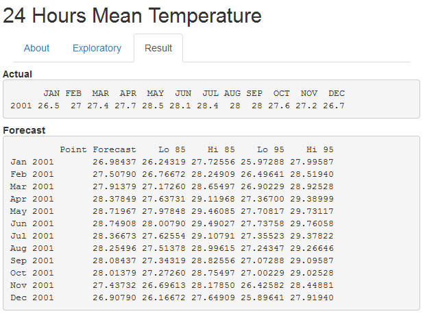

## Developing Data Products


24 Hours Mean Temperature

<small>[Lim Tee Yong](https://sg.linkedin.com/in/teeyong)</small>

<small>[Source code](https://github.com/tydatasc/Developing-Data-Products)</small>

---&vertical

## About

<a href="#" class="image navigate-down">
  
</a>

***

## Web Application

This web application is created by using **Shiny**

A web application framework for R

Please visit [Shiny](http://shiny.rstudio.com/) for more details

<a href="#" class="image navigate-down">
  
</a>

***

## Data

Data use is "24 Hours Mean Temperature" downloaded from [Data.gov.sg](http://www.data.gov.sg/home.aspx)

<p>Data.gov.sg is the primary portal for users to discover data published by the Singapore Government and its agencies.</p>

The data used for analysis can be downloaded from  [here](http://www.data.gov.sg/Metadata/SGMatadata.aspx?id=2601100000000014645G&mid=147808&t=TEXTUAL)

<a href="#/2" class="image">
  
</a>

---

## Web Application

There are 3 tabs on the web application.

- "About" - a short notes about the work of this site

- "Exploratory" - allow you to select year range and present back a table plus some summaries

```{r, echo=FALSE}
rawdf <- read.csv("24temp.csv", sep = ';')
rownames(rawdf) <- rawdf[,1]
df <- rawdf[,-1]
```

Summary such as Highest temperature is been show on the fly
```{r, echo=FALSE}
max(df)
```

- "Result" - Will show the actual and forecast data plus a plot

---

## Time Series

An ordered sequence of values of a variable at equally spaced time intervals.

The usage of time series models:

<h6>1. Obtain an understanding of the underlying forces and structure that produced the observed data</h6>

<h6>2. Fit a model and proceed to forecasting, monitoring or even feedback and feedforward control.</h6>

A tslm is used to fit linear models to time series including trend and seasonality components.

```
#convert dataframe to time series
tsdf <- reactive(ts(as.vector(t(as.matrix(subdf()))), start = c(1984, 1), end = c(input$Year,12), frequency=12))
    
#fit time series linear regression
fit <- reactive({
fitds <- tsdf()
tslm(fitds ~ trend + season)})
    
#forecast 
f <- reactive(forecast(fit(), h=12,level=c(80,95)))
```

---

## Result

The forecast resut is very close to the actual with less than 0.8 degree celsius


